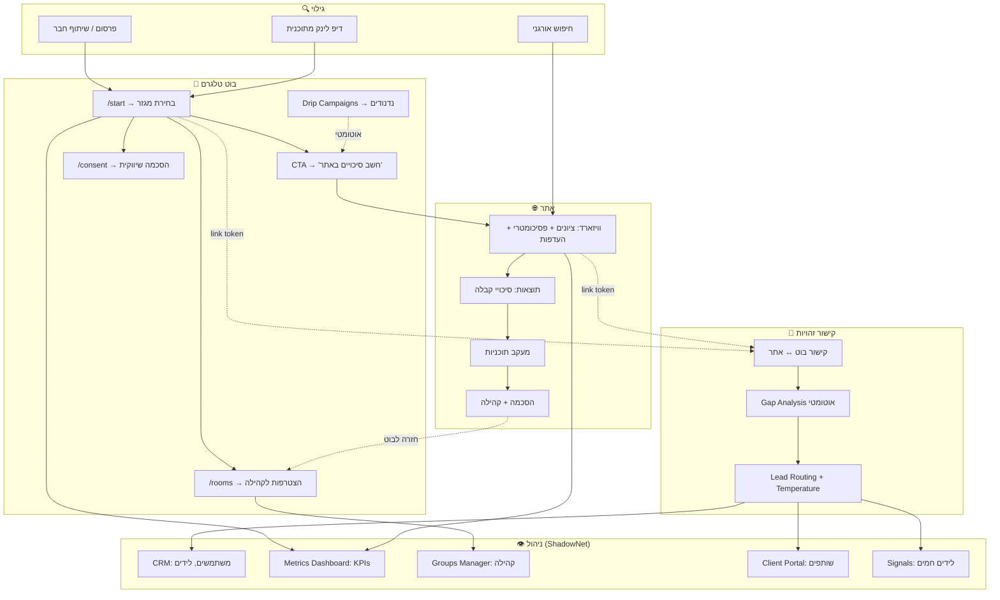
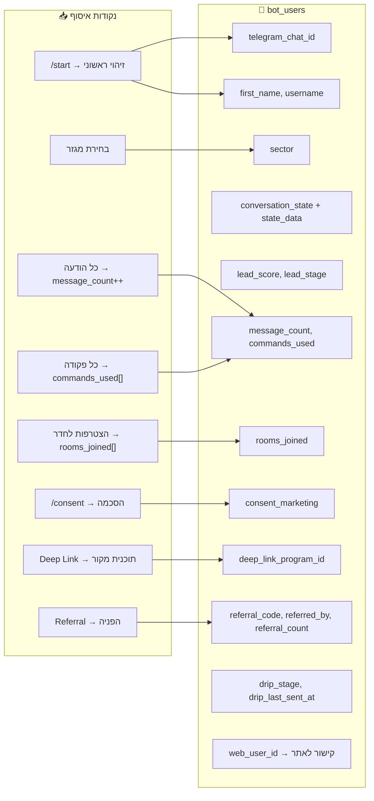
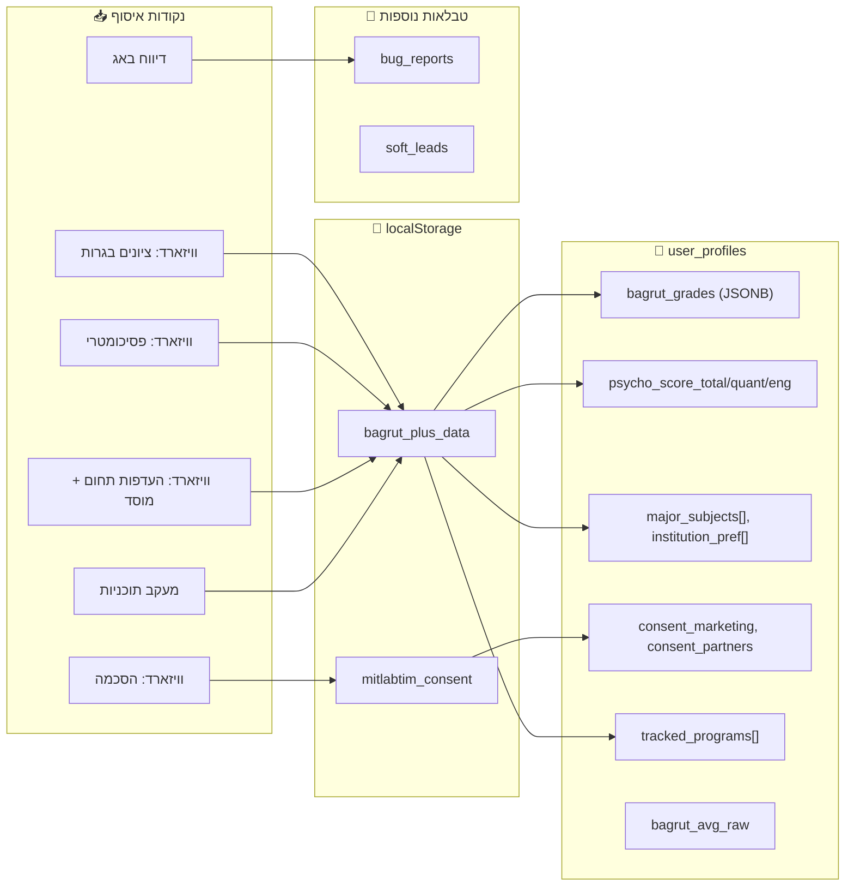
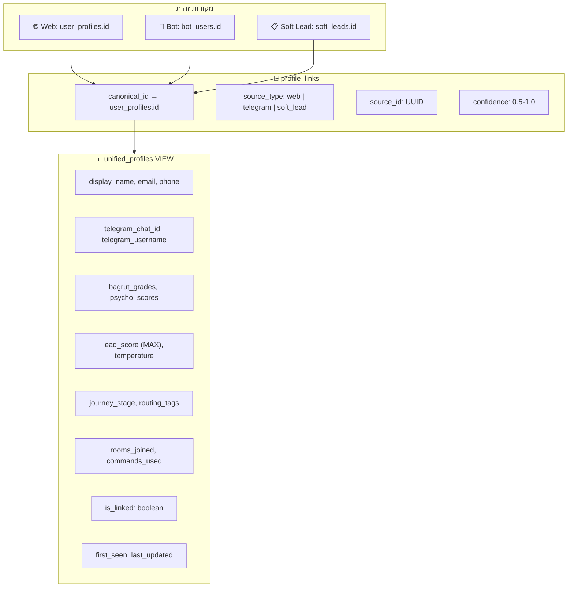
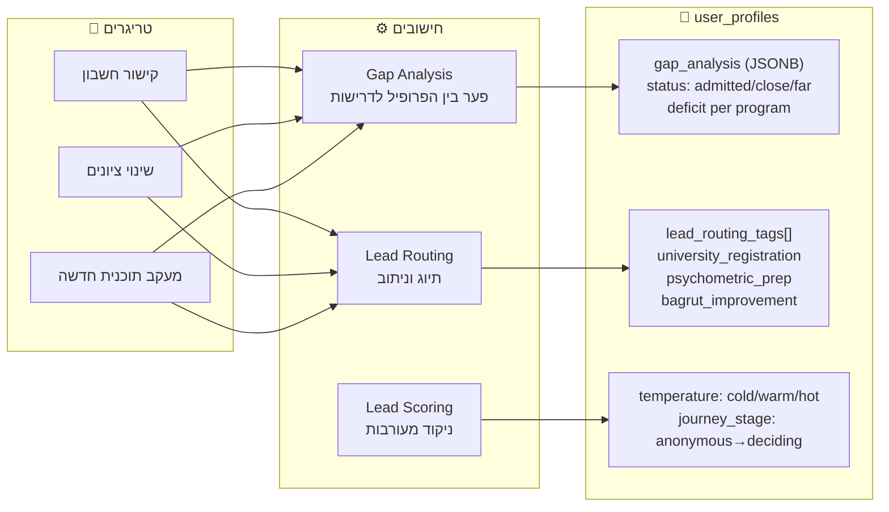
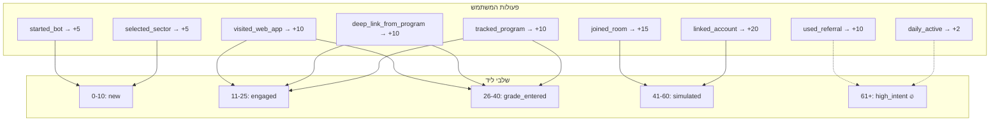
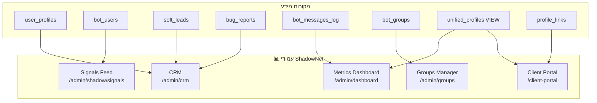
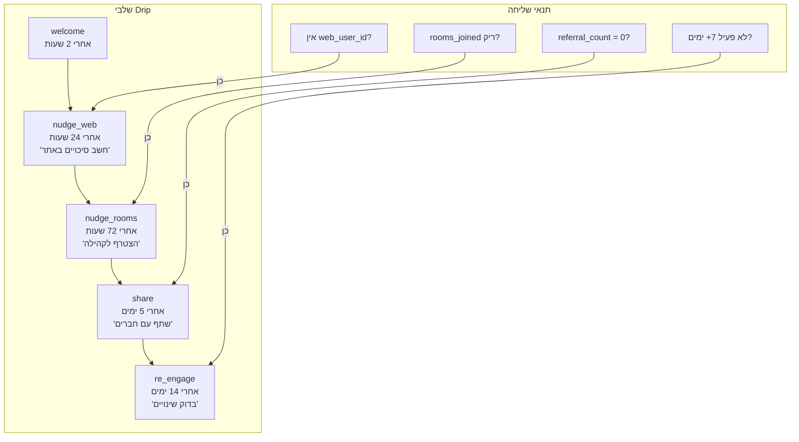
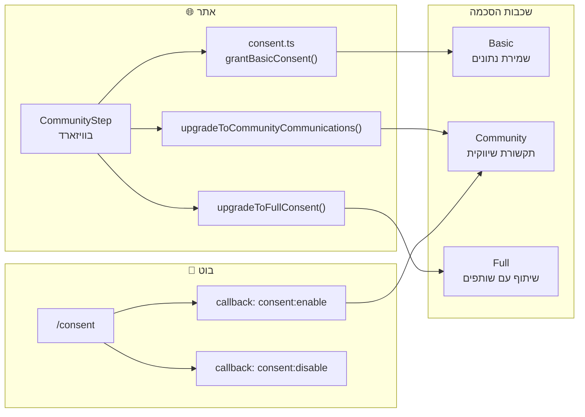

# User Story & Data Collection Map

## מסע המשתמש - מבט-על

---

## מה אוספים, מאיפה, ואיפה רואים

### 1. בוט טלגרם → `bot_users`

| שדה | מתי נאסף | handler |
|-----|----------|---------|
| `telegram_chat_id`, `first_name`, `username` | הודעה ראשונה | `middleware.ts → resolveUser()` |
| `sector` | בחירת מגזר (callback) | `start.ts → handleSectorSelection()` |
| `lead_score` | כל פעולה משמעותית | `lead-scoring.ts → updateLeadScore()` |
| `conversation_state` | מעבר בין שלבים | `user-service.ts → updateBotUser()` |
| `web_user_id` | קישור חשבון | `start.ts → handleLinkToken()` |
| `consent_marketing` | `/consent` | `consent.ts → handleConsentCallback()` |
| `rooms_joined` | הצטרפות לקבוצה | `group-events.ts → handleNewMember()` |
| `referral_code` | יצירת משתמש | `middleware.ts → resolveUser()` |
| `drip_stage` | שליחת drip | `drip-campaigns.ts` |
| `commands_used` | כל פקודה | `middleware.ts → logMessage()` |

---

### 2. אתר → `user_profiles` + `localStorage`

| שדה | מתי נאסף | קובץ |
|-----|----------|------|
| `bagrut_grades` | מילוי ציונים | `BagrutForm.tsx` → `saveUserData()` |
| `psycho_score_*` | מילוי פסיכומטרי | `PsychometricForm.tsx` → `saveUserData()` |
| `major_subjects`, `institution_pref` | וויזארד העדפות | `StepPreferences.tsx` |
| `tracked_programs` | לחיצת "מעקב" | `TrackedDegreesContext.tsx` |
| `consent_*` | שלב הסכמה | `CommunityStep.tsx` → `consent.ts` |
| `saved_simulations` | שמירת סימולציה | Dashboard `PlaygroundPanel.tsx` |

**זרימת שמירה:** Input → `App.tsx state` → `localStorage` (מיידי) → `saveUserData()` (debounce 1s) → Supabase `user_profiles`

---

### 3. קישור זהויות → `profile_links`

**מתי קורה קישור:**
- **ידני**: משתמש לוחץ "חבר חשבון" בבוט → מקבל link token → פותח באתר
- **אוטומטי**: `autoLinkSoftLead()` — התאמה לפי טלפון/אימייל

---

### 4. ניתוח אוטומטי → `user_profiles`

---

### 5. Lead Scoring — ניקוד מעורבות

---

### 6. היכן האדמין רואה הכל

| עמוד | מה רואים | API |
|------|----------|-----|
| **CRM** (`/admin/crm`) | טבלת משתמשים, ציונים, ממוצע בגרות, פסיכומטרי, פעילות אחרונה. לידים מהירים (soft_leads). דיווחי באגים. | ישיר מ-Supabase |
| **Metrics** (`/admin/dashboard`) | סה"כ משתמשים, בוט, לידים. משתמשים חדשים/פעילים. הודעות בוט. לידים חמים. ממוצע lead score. גרפי timeseries. | `/api/metrics/*` |
| **Groups** (`/admin/groups`) | קבוצות/topics פעילים. מספר חברים. שליחת תוכן (bait). יצירת topics. | `/api/telegram-rooms` |
| **Signals** (`/admin/shadow/signals`) | לידים חמים (score ≥ 60). שלב מסע. פעילות אחרונה. | ישיר מ-Supabase |
| **Client Portal** (`/client-portal`) | Social proof (סה"כ משתמשים, חישובים השבוע). סגמנטים לפי journey_stage. | `/api/metrics/client-view` |

---

## טבלת סיכום: Data × Source × Storage × Admin

| סוג מידע | נקודת איסוף | `localStorage` | `user_profiles` | `bot_users` | טבלה אחרת | עמוד אדמין |
|-----------|-------------|----------------|------------------|-------------|------------|-------------|
| **ציונים בגרות** | וויזארד / טופס | `bagrut_plus_data` | `bagrut_grades` | — | — | CRM |
| **פסיכומטרי** | וויזארד / טופס | `bagrut_plus_data` | `psycho_score_*` | — | — | CRM |
| **מגזר** | בוט / וויזארד | `bagrut_plus_data` | — | `sector` | — | CRM |
| **העדפות לימוד** | וויזארד | `bagrut_plus_data` | `major_subjects`, `institution_pref` | — | — | — |
| **תוכניות במעקב** | אתר / בוט | `bagrut_plus_data` | `tracked_programs` | `tracked_programs` | — | — |
| **הסכמה** | בוט / אתר | `mitlabtim_consent` | `consent_*` | `consent_*` | — | — |
| **Lead Score** | פעולות בוט | — | `lead_score` | `lead_score` | — | Signals |
| **טמפרטורה** | חישוב אוטומטי | — | `temperature` | — | — | Signals |
| **שלב מסע** | חישוב אוטומטי | — | `journey_stage` | — | — | Metrics |
| **Gap Analysis** | חישוב אוטומטי | — | `gap_analysis` | — | — | — |
| **Routing Tags** | חישוב אוטומטי | — | `lead_routing_tags` | — | — | — |
| **הודעות בוט** | כל הודעה | — | — | — | `bot_messages_log` | Metrics |
| **חדרים/קהילה** | הצטרפות | — | — | `rooms_joined` | `bot_groups` | Groups |
| **הפניות (Referral)** | שיתוף | — | — | `referral_*` | — | — |
| **Drip Stage** | Cron אוטומטי | — | — | `drip_stage` | — | — |
| **לידים מהירים** | טופס באתר | `lead_captured` | — | — | `soft_leads` | CRM |
| **דיווחי באגים** | וידג'ט | — | — | — | `bug_reports` | CRM |
| **קישור זהויות** | קישור ידני/אוטו | — | — | `web_user_id` | `profile_links` | — |

---

## Drip Campaigns — אוטומציית מעורבות

---

## Consent Flow — זרימת הסכמה

